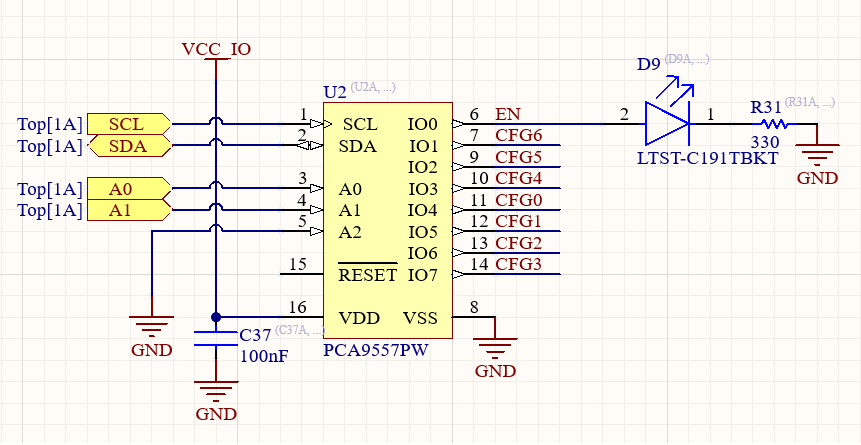

# PCA9557 STM32 Driver

STM32 HAL Driver for PCA9557 I/O Expander.
******  High-impedance open drain on P0 *****
## Features

- GPIO Input/Output
- Polarity Inversion Support
- STM32 HAL Compatible
- CubeIDE Ready

## Hardware Connection

